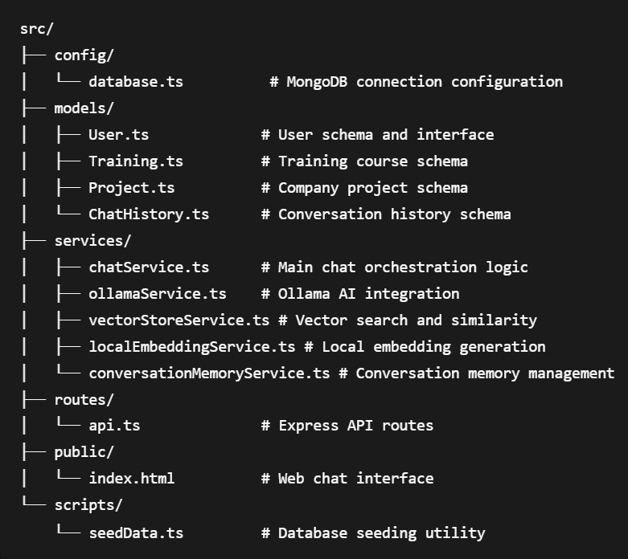

# AI Training & Project Recommendation Assistant
A *Node.js* *TypeScript* web application that provides intelligent recommendations for internal staff using AI-powered chat interface with *RAG* (Retrieval-Augmented Generation) architecture.

## Features  
+ **AI-Powered Chat Interface**: Intelligent conversations about trainings and company projects

+ **Personalized Recommendations**: Training suggestions based on user profile (department, position, completed trainings)

+ **Conversation Memory**: Maintains context across chat sessions for each user

+ **RAG Architecture**: Retrieval-Augmented Generation for accurate, context-aware responses

+ **Vector Search**: Semantic search for trainings and projects using local embeddings

+ **Multi-User Support**: Isolated conversation contexts for each user

+ **Real-time Chat**: Web-based chat interface with markdown support

+ **Admin Dashboard**: Manage trainings and projects with auto-indexing

## Tech Stack 

- **Backend**: Node.js, TypeScript, Express.js

- **Database**: MongoDB with Mongoose ODM

- **AI/ML**: Ollama (local LLM - llama3.1:8b)

- **Local Embeddings**: (Xenova/all-MiniLM-L6-v2)

- **Architecture**: RAG (Retrieval-Augmented Generation)

- **Frontend**: HTML, CSS, JavaScript

- **Embeddings**: Transformers.js for local embedding generation

## Prerequisites
* **Node.js** (v18 or higher)

* **MongoDB** (v4.4 or higher)

* **Ollama** (with llama3.1:8b model installed)

## Installation
1. **Clone the Repository**
   `bash
   git clone <your-repository-url>`
2. **Install Dependencies**
   `bash
   npm install`
3. **Environment Setup**
   Create a .env file in the root directory:

+ `MONGODB_URI=mongodb://localhost:27017/ai-training-assistant`
+ `OLLAMA_URL=http://localhost:11434
NODE_ENV=development`
+ `PORT=3000`

4.  **Database Setup** 
+ Create account at MongoDB Atlas

+ Create a cluster and get connection string

+ Update MONGODB_URI in .env file

5. **Ollama Setup**
+ Install Ollama (follow instructions from https://ollama.ai/)

+ Pull the required model
`ollama pull llama3.1:8b`
+ Start Ollama `service
ollama serve`
6. **Seed the Database**
   `npm run seed`

## Quick Start
1.  **Start the application**:`npm run dev`
2. **Access the application**:

- **Web Interface**: http://localhost:3000

- **API Health Check**: http://localhost:3000/api/health

📁 Project Structure

